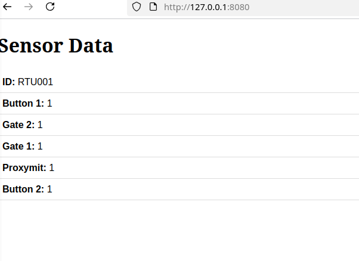
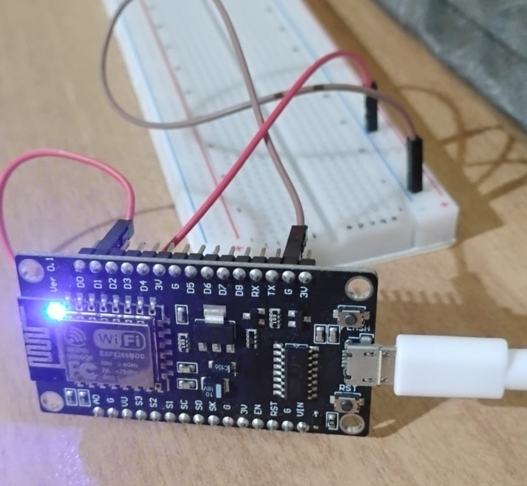
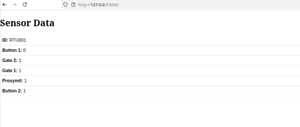

## ESP8266  MQTT  Publisher
------------------------

ESP8266 MQTT Client
A lightweight MQTT client running on ESP8266 that reads sensor data (e.g., temperature, humidity) and publishes it to a remote MQTT broker at regular intervals. Designed for IoT applications, it ensures efficient and reliable data transmission over Wi-Fi using the MQTT protocol.

# start development

clone the repo

```
python -m venv .venv
pip install -r requirments.txt
```
rename .env_sample to .env

update the .env 

```
# create config.cpp
python setup_config.py

```
Now open the r_module in Arduino IDE

connect the ESP8266 board to the USB port

upload the code


# verify
```
## This will print the sensor data published by esp8266 to the topic
python test/mqqt_test_consumer.py

```


# run web server

```
python tests/server.py

```






### test by publishing test data

```
python tests/mqtt_test_publisher.p

```